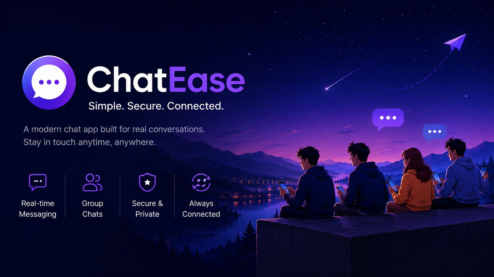
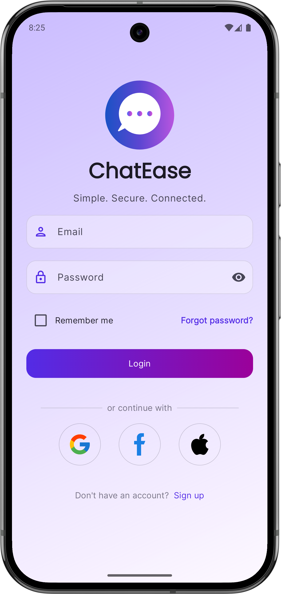
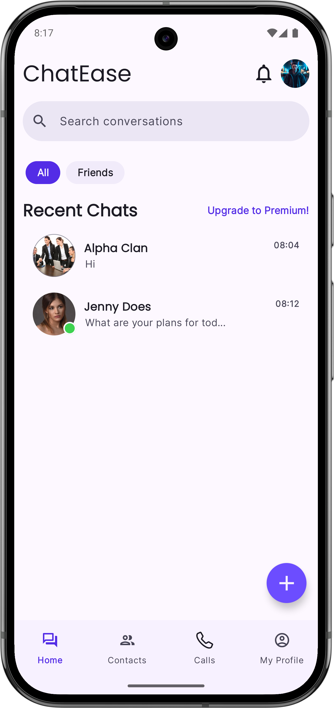
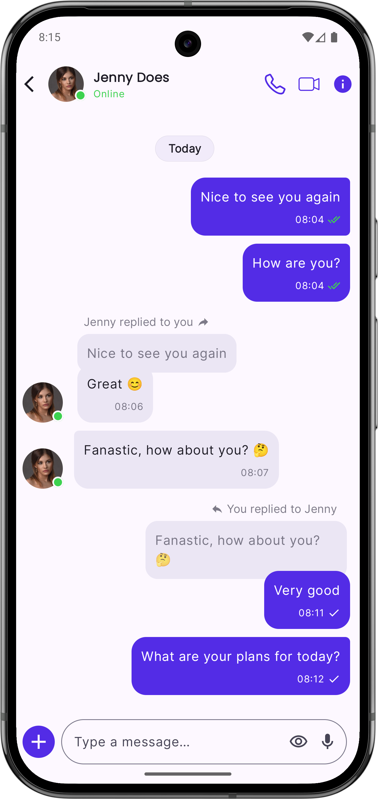
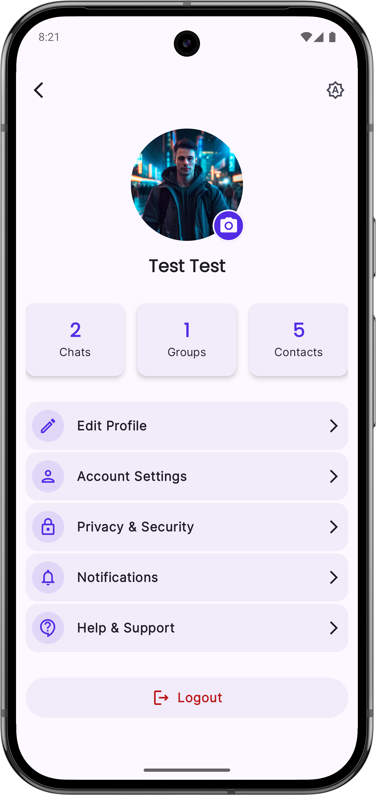
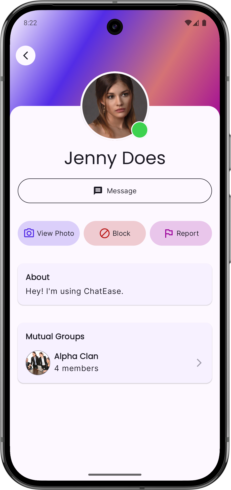
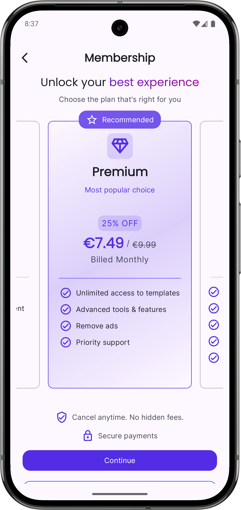

# ChatEase

# ChatEase

ChatEase is an Android messaging app built with **Kotlin** and **Jetpack Compose**.

## Features

- Direct and group chats
- Replies and reactions
- Image and file attachments
- Presence, typing indicators, and Peek
- Contacts and user blocking
- Membership plans
- Adaptive phone/tablet UI
- Light and dark themes

## Tech Stack

- Kotlin
- Jetpack Compose / Material 3
- MVVM
- Hilt
- Coroutines / Flow
- Firebase Authentication
- Cloud Firestore
- Firebase Storage
- Firebase Cloud Functions
- Coil 3

## UI Preview

<p>

&nbsp;&nbsp;&nbsp;

&nbsp;&nbsp;&nbsp;

</p>

<p>

&nbsp;&nbsp;&nbsp;

&nbsp;&nbsp;&nbsp;

</p>

## Setup

1. Download or clone this project.

2. Add your Firebase `google-services.json` to:

```text
app/google-services.json
```

3. Enable Authentication, Firestore, Storage, and Cloud Functions.

4. Install Firebase CLI:

```bash
npm install -g firebase-tools
```

5. Deploy Firebase Functions:

```bash
firebase login
firebase use <your-project-id>
firebase deploy --only functions
```

6. Open the project in Android Studio, sync Gradle, and run the app.

## License

This project is licensed under the **MIT License**.

